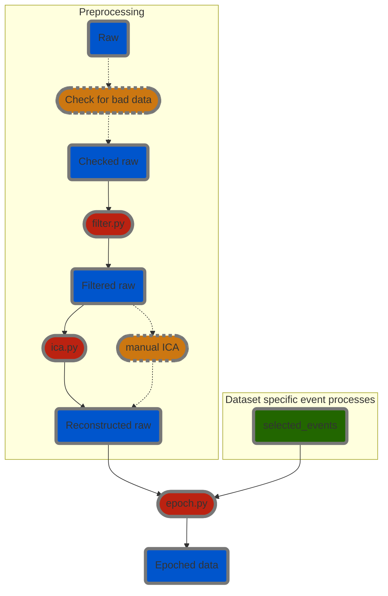

# MNE-MVPA
An extension of MNE-python to perform Multi-Variate Pattern Analysis.

```mermaid
graph TD
    %% Processes
    classDef automatic_process fill: #b21, stroke-width: 5px, stroke: #777
    classDef manual_process fill: #c71, stroke-width: 5px, stroke: #777, stroke-dasharray: 5, 5;
    
    %% Data
    classDef mne_data fill: #05c, stroke-width: 5px, stroke: #777
    classDef event_data fill: #260, stroke-width: 5px, stroke: #777
    classDef other_data fill: #55c, stroke-width: 5px, stroke: #777

    %% Preprocessing MEG data
    subgraph "Preprocessing"
    
        %% Manual check for bad channels, artefacts etc.
        raw_data("Raw"):::mne_data -.-> check_raw(["Check for bad data"]):::manual_process;
        check_raw -.-> checked_raw("Checked raw"):::mne_data;
        
        %% Filter the raw files
        checked_raw --> filter_raw(["filter.py"]):::automatic_process;
        filter_raw --> filtered_raw("Filtered raw"):::mne_data;
        
        %% Artefact removal with ICA
        filtered_raw --> ica(["ica.py"]):::automatic_process;
        ica --> recon_raw("Reconstructed raw"):::mne_data;
        filtered_raw -.-> man_ica(["manual ICA"]):::manual_process;
        man_ica -.-> recon_raw;
    end
    
    %% Processes specific to datasets (event processing)
    subgraph "Dataset specific event processes"
        selected_events("selected_events"):::event_data;
    end
    
    %% Epoching
    recon_raw --> epoch(["epoch.py"]):::automatic_process;
    selected_events --> epoch;
    epoch --> epochs("Epoched data"):::mne_data;
    
```