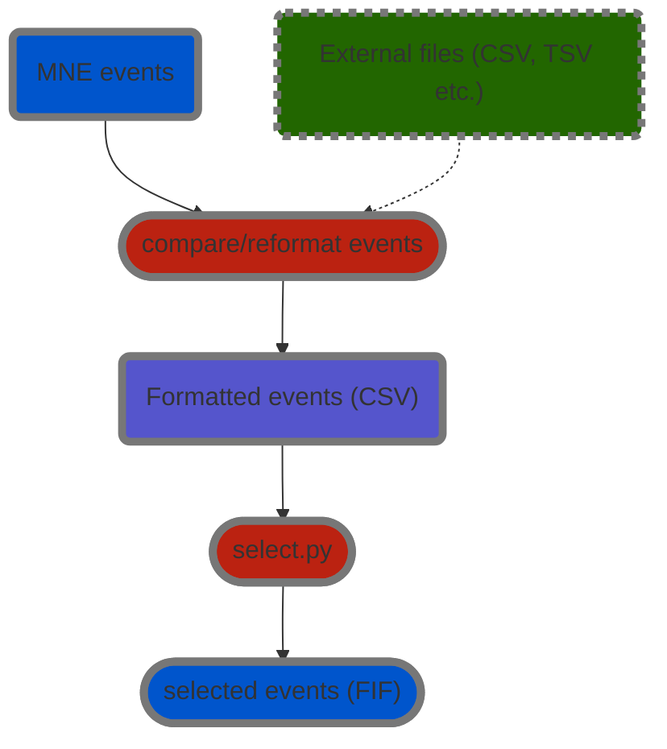

# Events processing

General processing strategy for events information is to:
- make use of both channel based events information and external file based information
- compare + verify + reformat into a single `CSV` file
- select relevant events and save as `FIF` data

> **_NOTE:_**
> `blue`: MNE python data
> `green`: `CSV`, `TSV` or other data format
> `red`: process
> `violet`: dataset specific reformatted `CSV` file

